# 🎖️ IBM Data Science Certification
SpaceX Falcon 9 first stage success landing prediction with Machine Learning Models  
  
This is the rersult of the IBM Data Science Certification capstone.  

## We will predict if the SpaceX Falcon 9 first stage will land successfully.  

SpaceX advertises Falcon 9 rocket launches on its website, with a cost of 62 million dollars; other providers cost upward of 165 million dollars each, much of the savings is because SpaceX can reuse the first stage.

Therefore if we can determine if the first stage will land, we can determine the cost of a launch.  
This information can be used if an alternate company wants to bid against SpaceX for a rocket launch.  
  
## Table of Contents
- [Data Collection Notebook](01_data-collection-api.ipynb) - Collects data from the SpaceX API, cleans and saves it to a csv file.
- [Webscraping Notebook](02_webscraping.ipynb) - Extracts a Falcon 9 launch records HTML table from Wikipedia, parses the table, convert it into a Pandas data frame and saves it to a csv file.
- [Data Wrangling Notebook](<03_data wrangling.ipynb>) - Performs exploratory  Data Analysis and determine Training Labels.
- [SQL Exploratory Data Analysis Notebook](04_eda-sql-sqllite.ipynb) - Uses SQL to explore the data.
- [Exploratory Data Visualization](05_eda-dataviz.ipynb) - Performs exploratory Data Analysis and Feature Engineering using `Pandas` and `Matplotlib`.
- [Interarctive Map](06_launch_site_location.ipynb) - Uses `Folium` to create an interactive map of the launch sites and some data marks.
- [Dashboard Application](07_dashboard_application.ipynb) - Crerates a dashboard application using `Plotly Dash`.
- [Machine Learning Prediction](08_Machine_Learning_Prediction.ipynb) - Determine Training Labels, finds the best hyperparameters for different models such as 'SVN', 'Classification Trees' and 'Logistic Regression' and evaluates their performance.
  
## Presentation
[Power Point](00_presentation_ds-SpaceX-capstone.pptx) presentation of the project.  

## Winning Space Race with Data Science

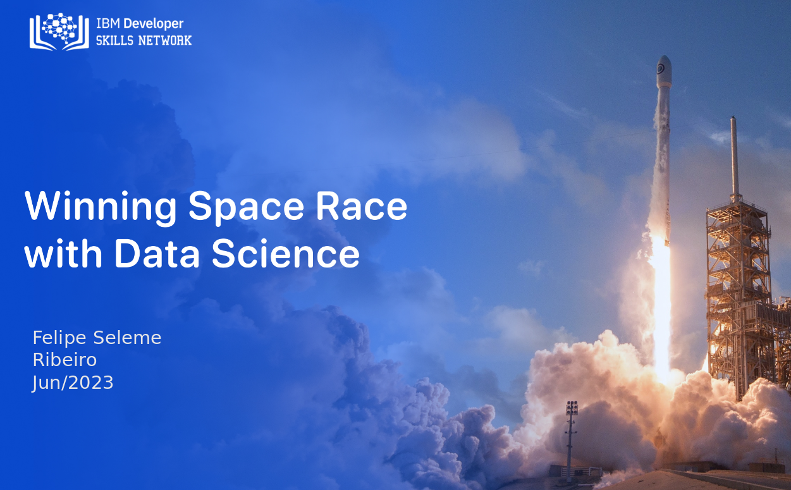

### Introduction

In the project's introduction, we highlight the background and context of the study, focusing on SpaceX and its Falcon 9 rocket launches. SpaceX stands out by offering significantly lower prices, with a launch cost of $62 million compared to competitors' prices exceeding $165 million. This cost reduction stems from SpaceX's ability to recover and reuse the Falcon 9's first stage. If we can accurately predict the success of the first stage landing, it becomes possible to determine the cost associated with each launch. This valuable information can empower alternative companies to compete against SpaceX by making informed decisions when bidding for rocket launches, potentially challenging SpaceX's market dominance.

### Problems

- Understand the factors influencing successful rocket landing.
- Correlation between features and landing success.
- Optimal operational conditions for successful landings.

### Methodology

#### Data Collection
The Falcon 9 first stage data collection was done with a get request to the SpaceX API and by web scraping the Falcon 9 Wikipedia page.

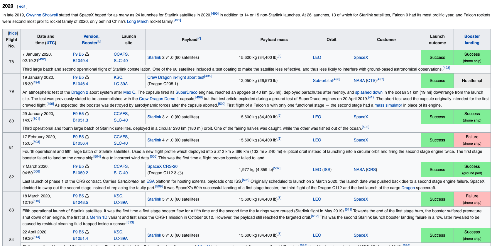  

##### Request to the SpaceX API and clean the requested data

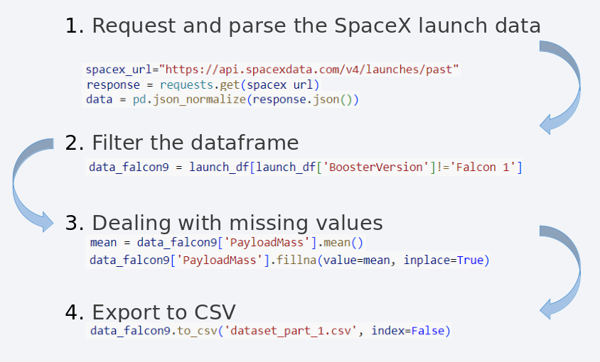  
[Click here to view the code.](01_data-collection-api.ipynb)

##### Extract a Falcon 9 launch recors HTM table from Wikipedia, parse the table and convert it into a Pandas dataframe

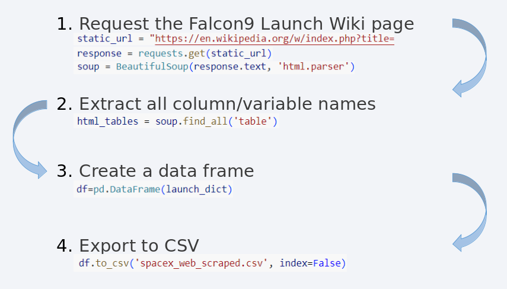  
[Click here to view the code.](02_webscraping.ipynb)

#### Data Wrangling

##### Exploratory Data Analysis (EDA)
- Calculate the number of launches on each site
- Calculate the number and occurrence of each orbit
- Calculate the occurrence of mission outcome

##### Determine Training Labels
- Create a landind outcome label

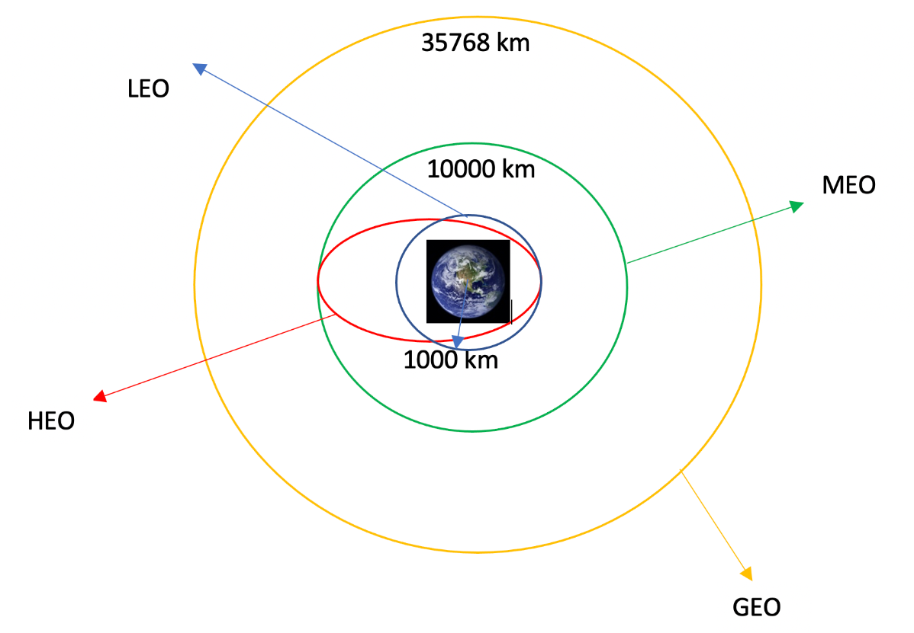  
Each launch ains to a dedicated orbit.  
[Click here to view the code.](03_data-wrangling.ipynb)

#### EDA with Data Visualization

##### 📍️ Scatter Graphs 
- Flight Number vs Payload Mass
- Flight Number vs Launch Site
- Payload Mass vs Launch Site
- Flight Number vs Orbit
- Payload Mass vs Orbit

##### 📊️ Bar Chart 
- Orbit vs Success Rate

##### 📈️ Line Chart 
- Year vs Success Rate

[Click here to view the code.](05_eda-dataviz.ipynb)

#### EDA with SQL

- Display the names of the unique launch sites  in the space mission
- Display 5 records where launch sites begin with the string 'CCA’
- Display the total payload mass carried by boosters launched by NASA (CRS)
- Display average payload mass carried by booster version F9 v1.1
- List the date when the first succesful landing outcome in ground pad was achieved
- List the names of the boosters which have success in drone ship and have payload mass greater than 4000 but less than 6000
- List the total number of successful and failure mission outcomes
- List the names of the booster_versions which have carried the maximum payload mass
- List the records which will display the month names, failure landing_outcomes in drone ship ,booster versions, launch_site for the months in year 2015
- Rank the  count of  successful landing_outcomes between the date 04-06-2010 and 20-03-2017 in descending order

[Click here to view the code.](04_eda-sql-sqllite.ipynb)

#### Building an Interactive Map with Folium

##### Marking all launch sites on a map:  

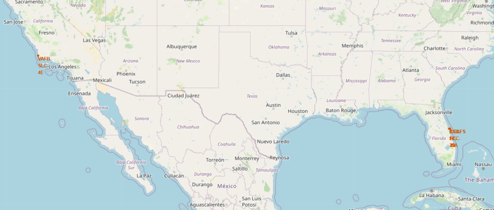

We can observe that all launch sites are in proximity to the Equator line and very close proximity to the coast.  

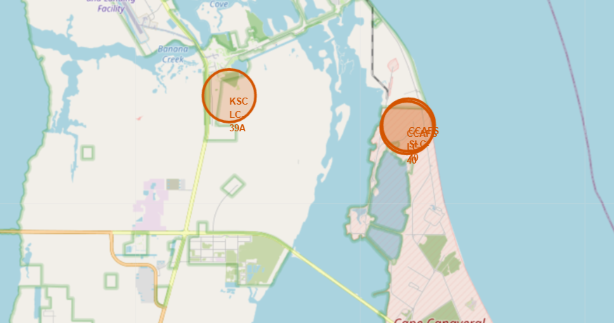

##### Marking the success/failed launches for each site on the map

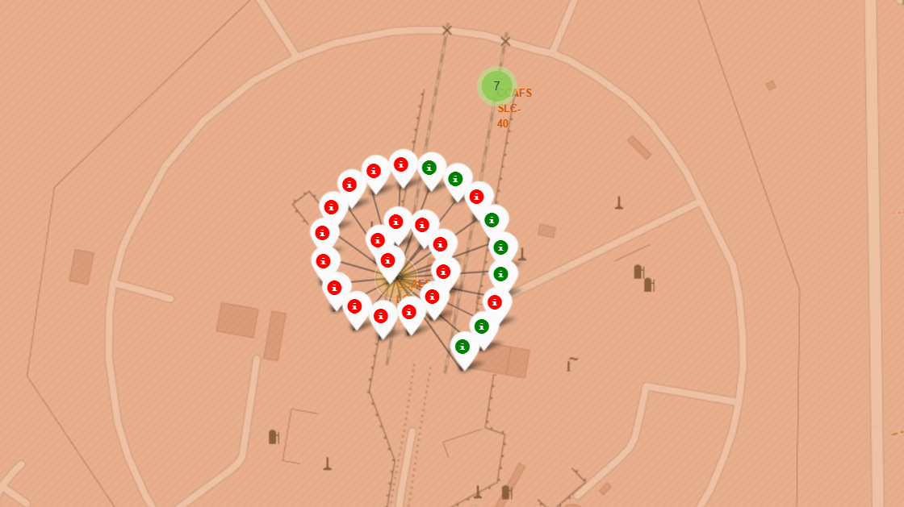  
It shows the success and failed launches for each site in na interactive map.  

##### Calculate the distances between a launch site to its proximities

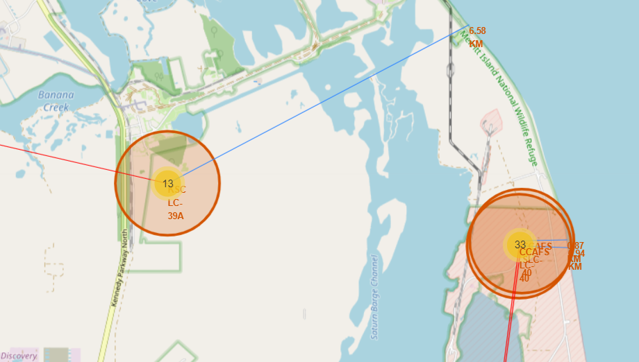  
Shows the distances between a launch site to its proximities in an interactive map.  
[Click here to view the code.](06_launch_site_location.ipynb)

#### Building a Dashboard with Ploty Dash

Pie Chart showing the total launches by a certain site or all sites.  
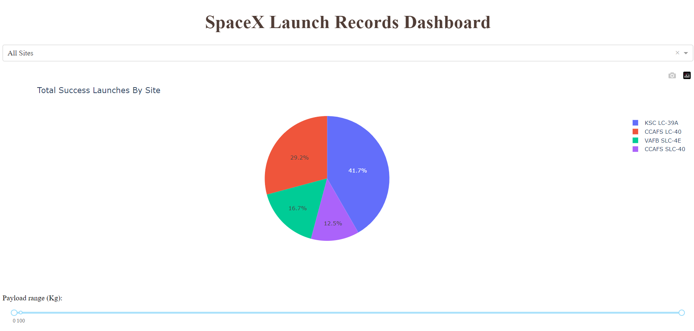  
[Click here to view the code.](07_dashboard_application.ipynb)    

Scatter Graph showing the relationship with  Outcome and Payload Mass.  
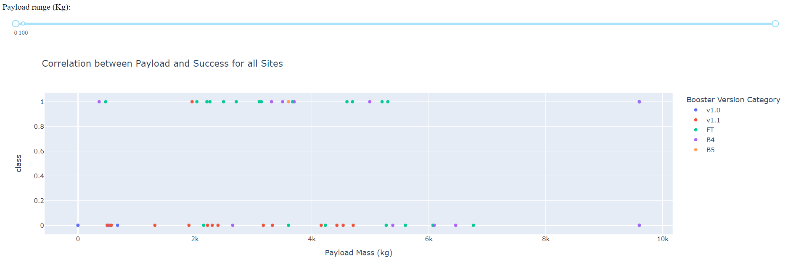  
[Click here to view the code.](07_dashboard_application.ipynb)    

#### Predective Analysis (Classification)   

- Load the data
- Standarize the data and fit the model
- Split the data into train and test
- Create differet models:
  - Logistic Regression
  - Support Vector Machine (SVM)
  - Decision Tree Classifier
  - K Nearest Neighbors
- Calculate the accuracy on aech model
- Build a confusion matrix to visualiza the accuracy
- Compare the predictions accuracy for each model
  
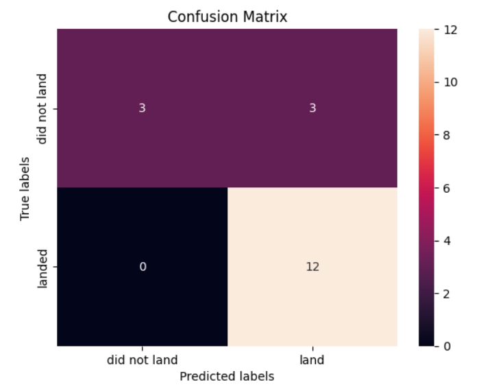  
[Click here to view the code.](08_Machine_Learning_Prediction.ipynb)  

### Results
- Exploratory data analysis results
- Interactive analytics demo in screenshots
- Predictive analysis results

#### Insights drawn from EDA

##### Flight Number vs. Launch Site

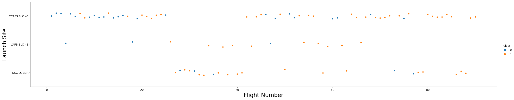  

The larger the flight amount at a launch site, the greater the success rate at a launch site.  

##### Payload vs. Launch Site

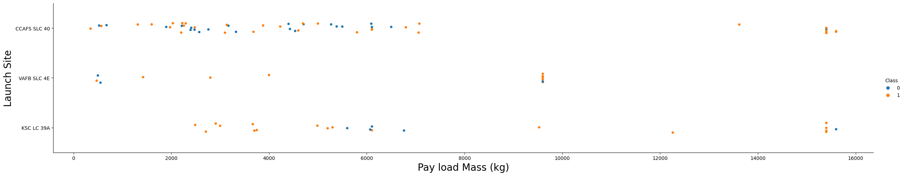  

It seems that the greater the payload for Launch Site CCAFS SCL 40, the higher the success rate for the rocket. However, there is not a quite clear pattern for the other Launch Sites.

##### Success Rate vs. Orbit Type

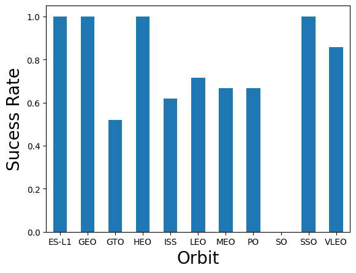  
The most success rate are for the orbits:  
- ES-L1
- GEO
- HEO
- SSO

  

##### Flight Number vs. Orbit Type

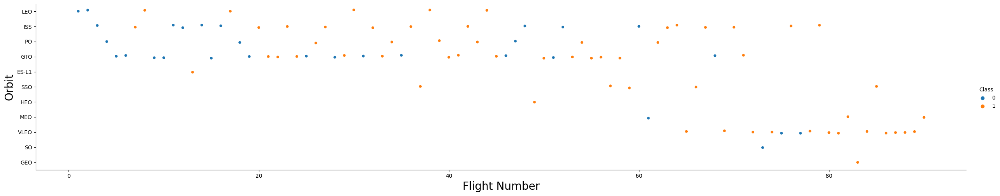  

In the LEO orbit, it seems to have a relation between the number of flights and the success. However, the GTO orbit shows no relationship between flight number and success.

##### Payload vs. Orbit Type

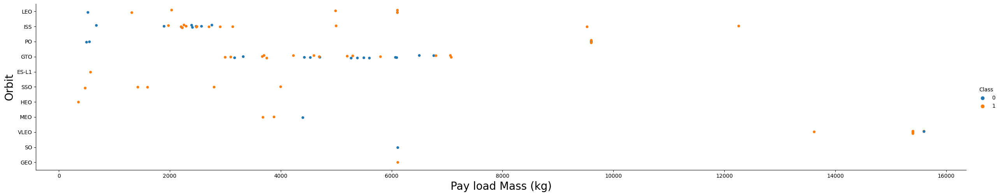  

Heavy payloads seems to have a negative influence on GTO orbits and positive on LEO and ISS orbits.

##### Launch Success Yearly Trend

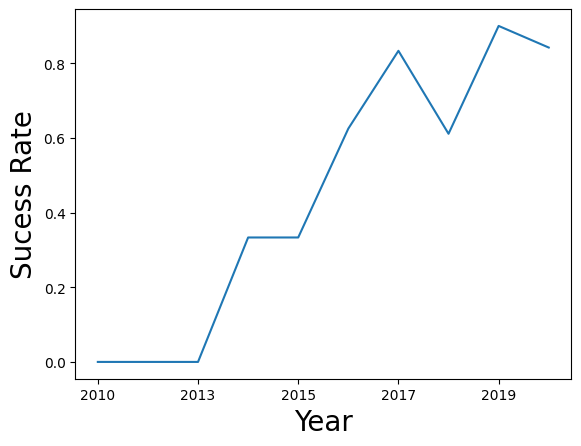  

The success rate kept increasing since 2013 till 2020.

##### All Launch Site Names

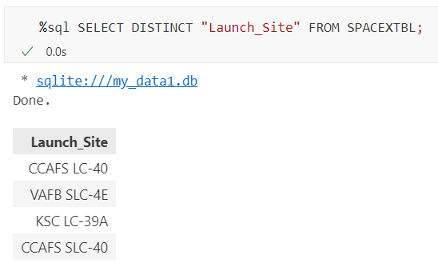  

Find the names of the unique launch sites

##### Launch Site Names Begin with 'CCA'

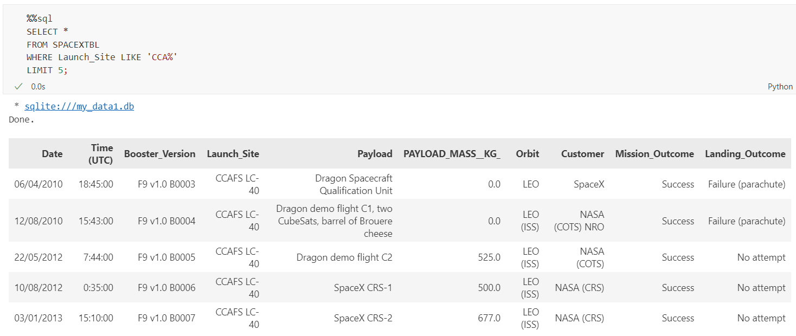  

Find 5 records where launch sites begin with `CCA`.

##### Total Payload Mass

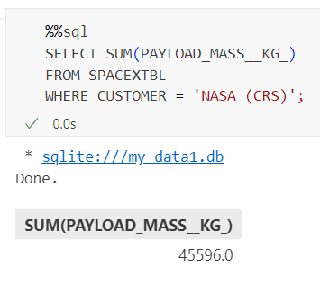  

Calculate the total payload carried by boosters from NASA.

##### Average Payload Mass by F9 v1.1

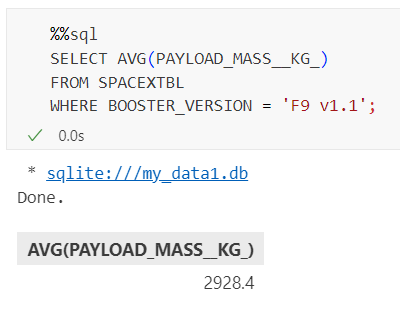  

Calculate the average payload mass carried by booster version F9 v1.1

##### First Successful Ground Landing Date

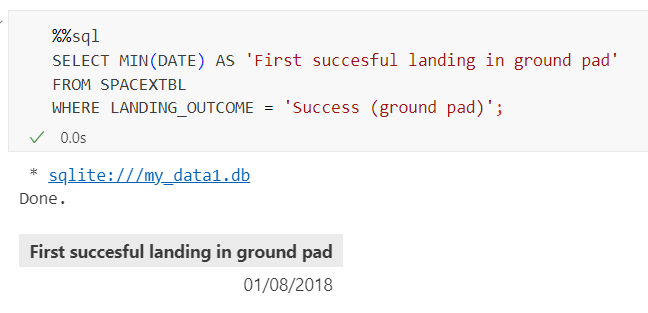  

Find the dates of the first successful landing outcome on ground pad.

##### Successful Drone Ship Landing with Payload between 4000 and 6000

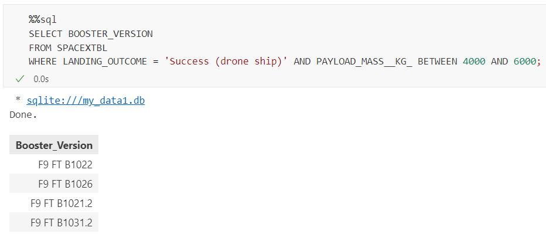  

List the names of boosters which have successfully landed on drone ship and had payload mass greater than 4000 but less than 6000.

##### Total Number of Successful and Failure Mission Outcomes

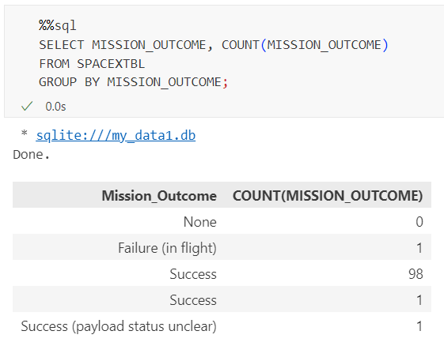  

Calculate the total number of successful and failure mission outcomes.

##### Boosters Carried Maximum Payload

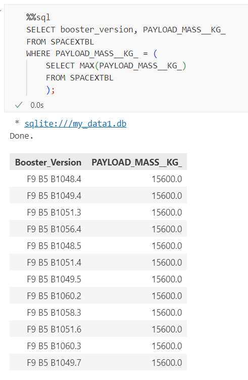  

List the names of the booster which have carried the maximum payload mass.

##### 2015 Launch Records

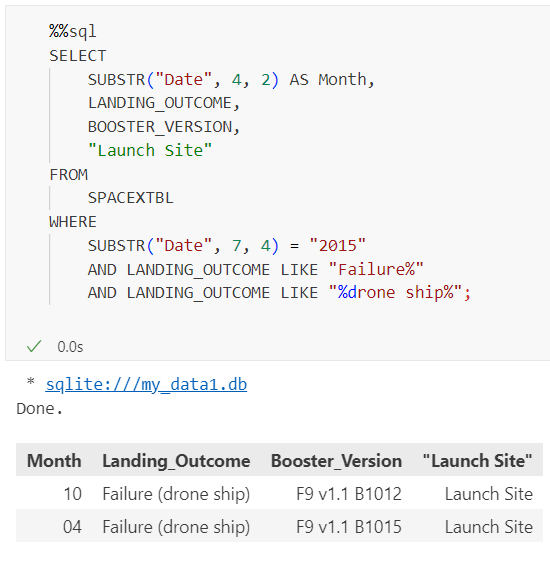  

List the failed landing_outcomes in drone ship, their booster versions, and launch site names for in year 2015.

##### Rank Landing Outcomes Between 2010-06-04 and 2017-03-20

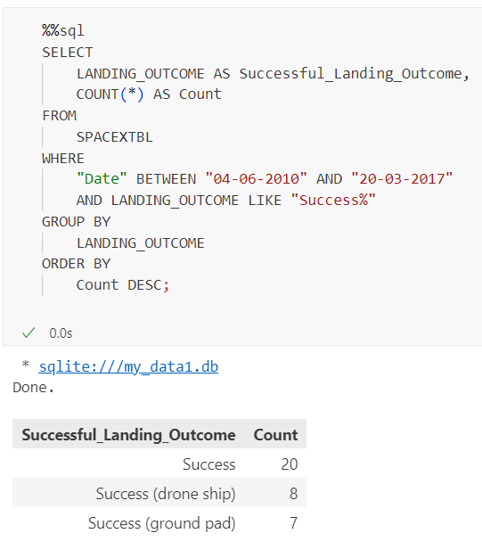  

Rank the count of landing outcomes (such as Failure (drone ship) or Success (ground pad)) between the date 2010-06-04 and 2017-03-20, in descending order.

#### Launch Sites Proximities Analysis

##### All Launch Sites – Global Markers

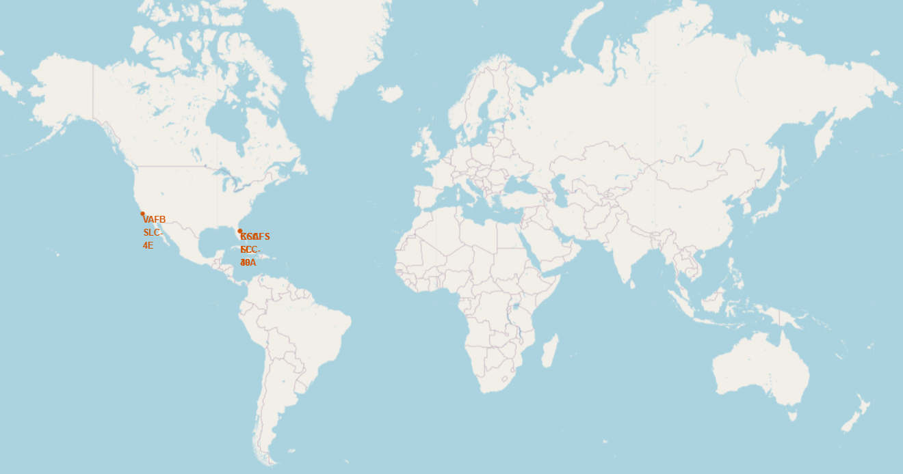  

As we can se, the SpaceX launch sites are in the United States of America coasts (Florida and California).

##### Color Labelled Markers

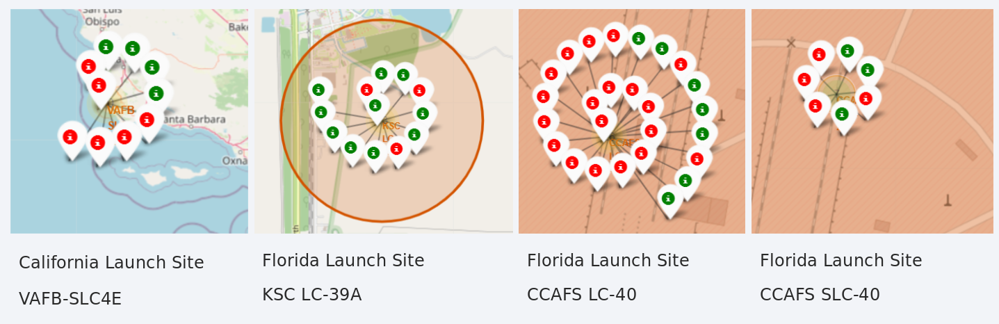  

*Green Markers shows successful launches and Red Markers shows failures.

##### Distance to Landmarks

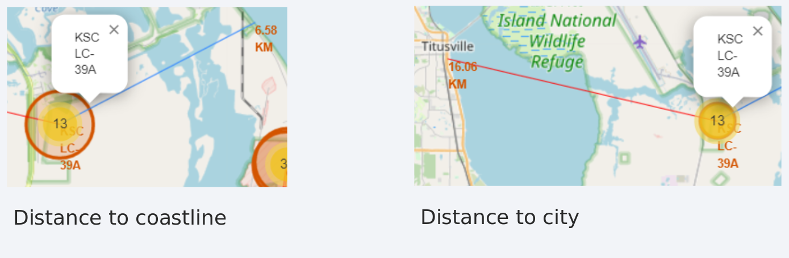  

The launch sites are in close proximity to coastline and keep certain distance away from cities, railways and highways.

#### Build a Dashboard with Plotly Dash

##### Total Success Launches By Site

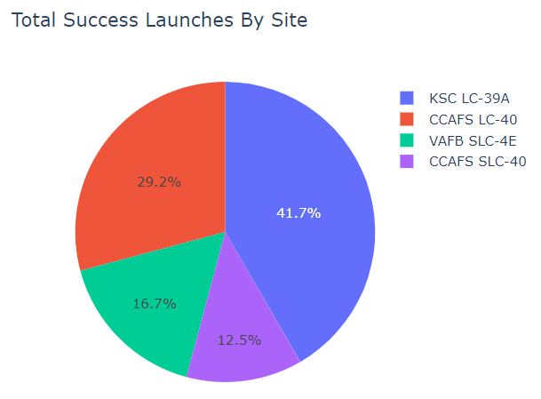  

KSC LC-39 A has the most successful launches

##### Total Success Launches for KSC LC-39A

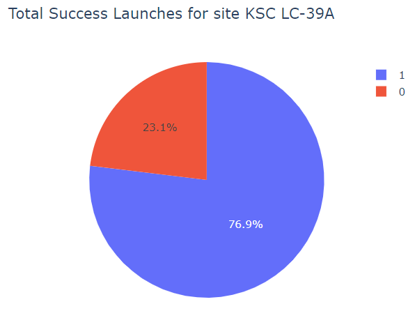  

KSC LC-39A achieved a 76,6% success rate.

##### Payload vs Success for Booster Category

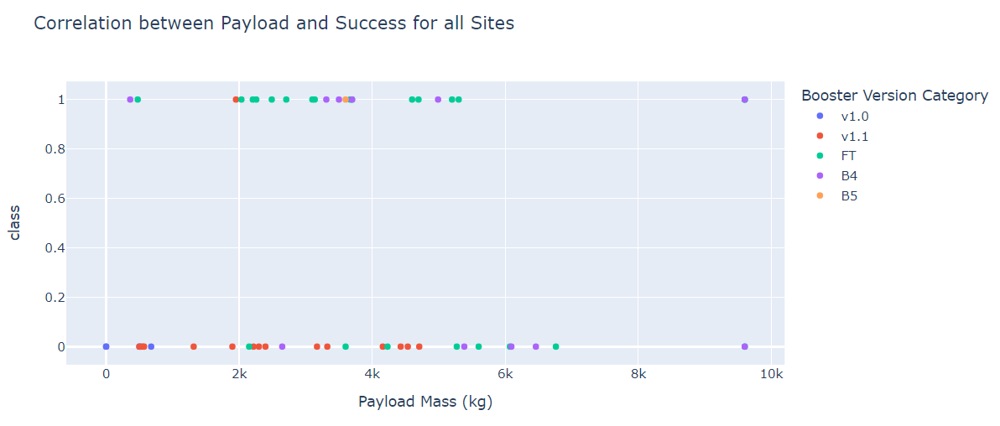  

We can see that the success rate is higher for low weighted payloads.

### Predective Analysis (Classification)

#### Classification Accuracy

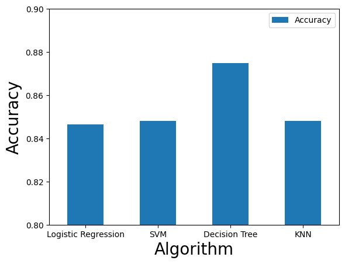  

The Decision Tree model has the highest classification accuracy.

#### Confusion Matrix

  

The Decision Tree model predicted 12 landed and 3 not landed right. But missed 3 not landed.

### Conclusions

#### Correlation between launch site activity and success rate

There is a positive relationship between the number of flights conducted at a launch site and the likelihood of a successful launch. As the flight amount increases at a particular site, the success rate also tends to increase.  

#### Temporal trends in launch success

Starting from 2013 and continuing until 2020, there has been a notable upward trend in launch success rates. Over this period, the probability of a successful launch has been consistently increasing.  

#### Success rates for different orbits

Orbits such as ES-L1, GEO, HEO, SSO, and VLEO demonstrate the highest success rates compared to other orbits. These specific orbits have shown a greater likelihood of achieving a successful mission.  

#### Outstanding performance of KSC LC-39A launch site

Among all launch sites, KSC LC-39A stands out as the site with the highest number of successful launches. It has consistently achieved a remarkable track record in terms of launch success.  

#### Optimal machine learning algorithm

The Decision Tree model has been identified as the most effective machine learning algorithm for this particular task. It outperforms other algorithms in accurately predicting the success or failure of rocket launches.  

## License
Copyright (c) 2023 Felipe Seleme Ribeiro  
  
  